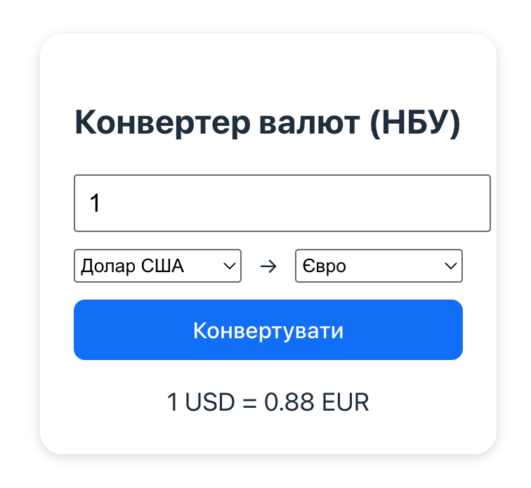

# Task: Currency Converter

## User Story

As a user, I want to convert between different currencies so that I can know the equivalent value in my desired currency.

## Description

Your task is to build a simple currency conversion service using Node.js.

## Requirements

1. **Currency Conversion Service**
   - Implement a backend service that retrieves current currency exchange rates from the [National Bank of Ukraine Open Data API](https://bank.gov.ua/ua/open-data/api-dev) and create an API endpoint that returns the exchange rate for a given currency pair, including a method to convert any amount from one currency to another (for example, USD to EUR).

2. **Currency Converter UI (React)**
   - Implement a simple user interface using React for currency exchange.
      - The page should include a form where a user can:
         - Select the source currency (e.g., USD).
         - Select the target currency (e.g., EUR).
         - Enter the amount to convert.
      - After clicking the “Convert” button, the UI should call your API and display the conversion result (e.g., “100 USD = 3675.25 UAH”).
   - Add basic validation (e.g., invalid or empty amount should show an error). 

   Example UI:
   

3. **API Endpoint with Caching**
   - Create an API endpoint that returns the exchange rate for a given currency pair.
   - Cache external exchange rate data to avoid unnecessary calls to the third-party API. Since the rates are updated once a day, the cache should live for at least one day.
